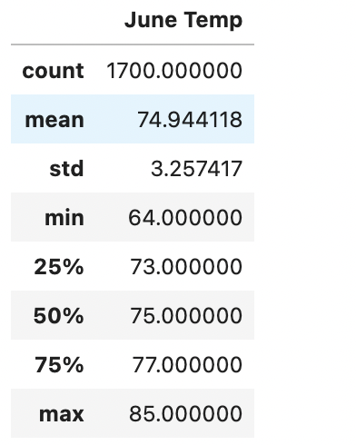
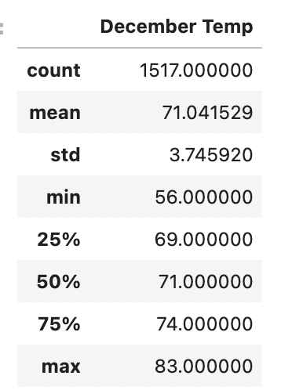

# surfs_up

##Overview of the analysis:

The purpose of analysis is to find the temperatures for the months of June and December in Oahu in order to determine if the surf and ice cream shop business is sustainable year-round.

##Results: 

Table summarize June's temperature statistics

Table summarizes Decembers temperature statistics

##Summary: 

- The temperatures in December are slightly lower than June but suitable for a surf and ice cream shop business.
- June temperatures range from 64 to 85 F whereas December Temps range from 56 to 83 F.
- Surf and ice cream shop business is sustainable year-round